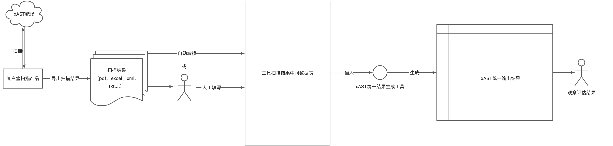

## 目的
统一xAST各工具的“中间”输出格式，基于统一的“中间数据格式”，自动化统计测试结果，并自动生成评价体系各评价项的通过情况，其中统一中间数据格式参考了OWASP的[BenchmarkUtils](https://github.com/OWASP-Benchmark/BenchmarkUtils/tree/main)的设计，整体设计思路如下图所示



## 开始使用
该工具需要在java 11版本运行，通过mvn进行编译和安装


运行扫描工具对xAST靶场进行扫描后，导出扫描结果，然后选择以下两种方法之一获取扫描工具在xAST评价体系下的评估结果：
- 通过命令行运行工具自动解析扫描结果，得到最终在xAST评价体系下对该扫描工具的评价结果（该方法需要本工具中存在扫描工具对应的结果解析器，也可自行编写解析工具，请见plugin/src/main/java/com/alipay/xast/score/parsers下的Reader工具，欢迎社区开发者参与共建～）
- 如未发现合适的结果解析器来解析你想测评的扫描工具的扫描结果，也可手动填写靶场中对应工具类型的xlsx文件，完成对`扫描识别为漏洞`一列的填写后，运行命令指定填写的xlsx文件得到评价结果

### 安装
```
cd Ant-xAST-Utils
mvn install
```

### 运行命令
对扫描结果的解析有自动转换和人工填写两种模式，其中自动转换需要有对应的Reader类才能实现，两者需要执行的命令分别如下：

（1）尝试自动转换扫描结果

使用已有的结果解析器对扫描结果进行解析，并获取结果
```
mvn com.alipay.xast:xastutils-maven-plugin:create-scorecard -DdirectoryPath=xast靶场绝对路径 -DresultFile=工具扫描结果绝对路径
```
修改需要指定的两个参数并运行
例如
```
mvn com.alipay.xast:xastutils-maven-plugin:create-scorecard -DdirectoryPath=/Users/admin/javaProject/ant-application-security-testing-benchmark -DresultFile=/Users/admin/Downloads/Benchmark_1.2-mySastTool-v2.0.2-11.xml
```
运行成功后，会生成xlsx表和html文件，其中xlsx表记录了扫描工具在每个靶场case上的识别情况，html文件为最终的评价结果，使用浏览器打开html文件，根据html文件中的各项数值了解扫描工具在xast评价体系中的表现。


如果xast-utils中没有扫描工具生成的结果文件的解析器，即Reader，可以编写对应的Reader类放到A中（欢迎将编写的Reader类提交到我们的仓库中，也欢迎修改[BenchmarkUtils](https://github.com/OWASP-Benchmark/BenchmarkUtils/tree/main)中的已有的Reader实现类提交到我们的仓库中），再运行上述命令

（2）人工填写扫描结果

`也可以手动填写靶场中的样本xlsx文件`，修改其中的【扫描识别为漏洞】列，按实际情况填写true和false，注意不要修改文件名最后的工具类型（sast/iast/dast），填写完成后，运行如下命令

```
mvn com.alipay.xast:xastutils-maven-plugin:create-scorecard -DdirectoryPath=靶场的绝对路径 -DxlsxFile=人工填写后的xlsx文件绝对路径
```

例如：
```
mvn com.alipay.xast:xastutils-maven-plugin:create-scorecard -DdirectoryPath=/Users/admin/javaProject/ant-application-security-testing-benchmark -DxlsxFile=/Users/admin/javaProject/ant-application-security-testing-benchmark/results/xAST_v_1.0.0_mySastTool_v2.0.0_sast.xlsx
```


## 背景
Ant-xAST-Utils是基于OWASP的[BenchmarkUtils](https://github.com/OWASP-Benchmark/BenchmarkUtils/tree/main)框架进行了适配xAST靶场的改造：
- 增加了不同工具类型的case文件处理
- 修改了中间数据的文件格式和每列内容
- 修改了最终评价中的指标参数为召回率、准确率和评价项达成率
- 增加了xAST各个工具下的引擎评价项达成详情

## 开源协议说明
为了方便使用者尽快感知扫描工具在xAST评价体系下的表现，同时尽可能减少使用者改写BenchmarkUtils项目中已有Reader的成本，因此Ant-xAST-Utils设计时引用了BenchmarkUtils的思路，但修改了执行流程中的几乎全部代码。当前目录下的文件与xAST开源项目的一部分，仅是方便使用者快速解析扫描结果而提供的工具，且尊重BenchmarkUtils的开源协议，当前目录下的各类文件同样遵循GPL协议，不影响根目录的其他xAST评价体系文件的开源协议

## FAQ
https://github.com/alipay/ant-application-security-testing-benchmark/wiki/FAQ

## 参与共建
https://github.com/alipay/ant-application-security-testing-benchmark/blob/main/CONTRIBUTING.md
